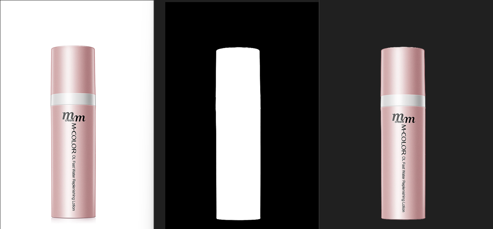
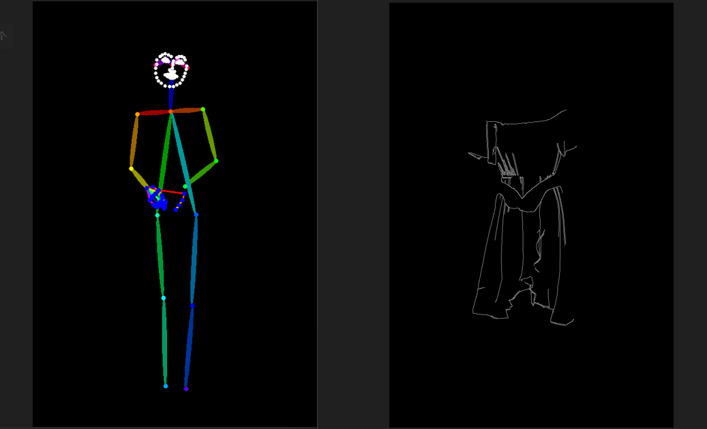
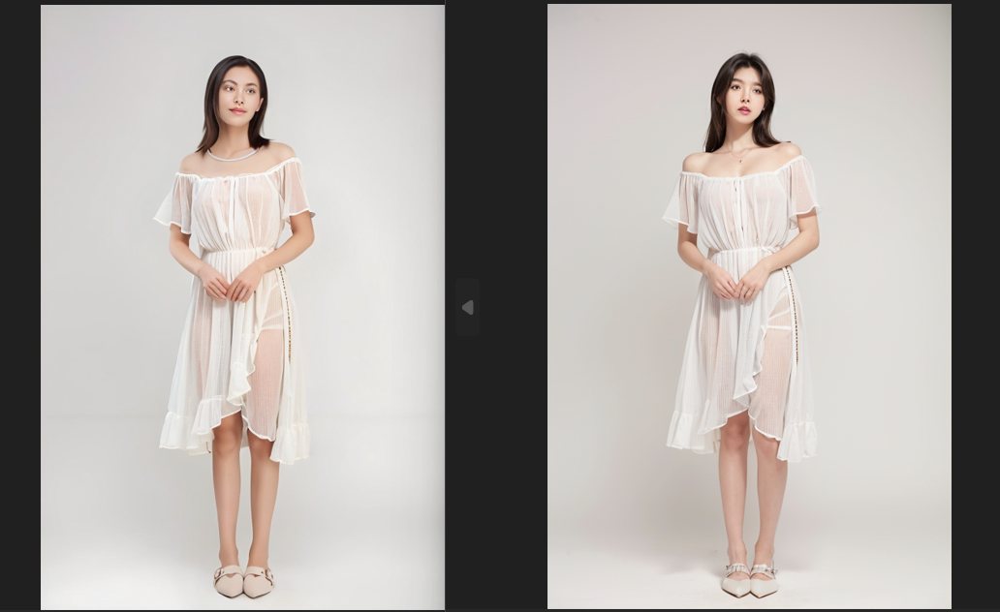
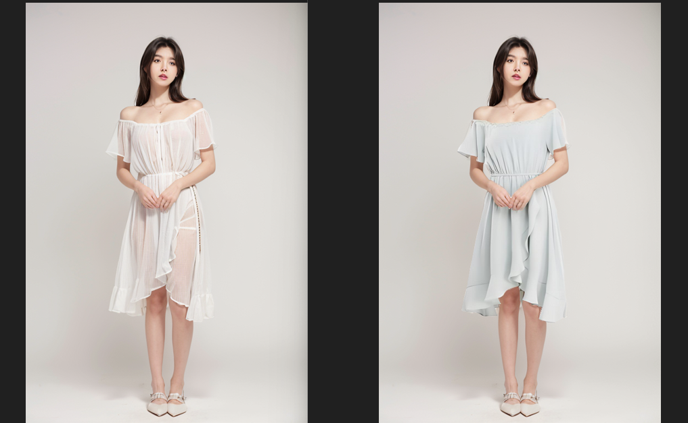
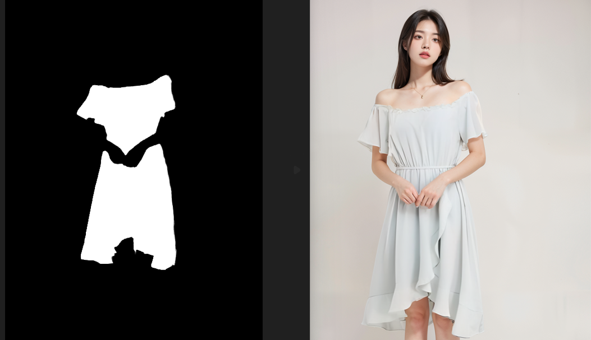
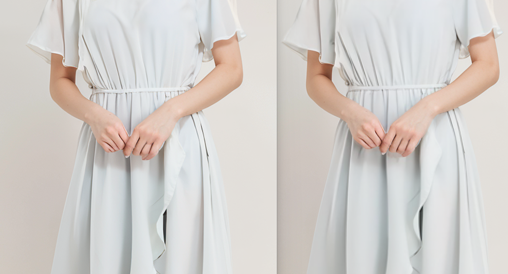

#### Links to traditional design works：

https://github.com/alpaca-htt/Design-works/tree/master/作品

## AICG_Comfy UI_ e-commerce products are obscured and rendered

#### The project implementation process

Requirements: E-commerce product background rendering workflow, which was later upgraded to product occlusion

1. Use Segmentation and SAM to capture product images

   

   You need to control the size of the original image, the resolution is too high and wastes computing power, the time is too long, and too low affects the cutout effect

   

2. The background reference diagram prompt words are reversed

   You can use WD to push back, you can also use the clip interrogator, you need to restore the background, you can use the clip interrogator, and you can use any switch node to perform prompt word or operation

   

3. If you need product foreground masking, add the following steps

   

   Hand draw the area that needs to be occluded, generate a mask, and mask the area of the product after masking

   

4. Use ControlNet to control the line art, depth

   

   

5. Ipadapt + Brushnet repaint

   

   IPadapter can be controlled, and the background is more closely related to the background reference map, so I chose to reduce the weight here to give the large model more room to play
   K+V:key + value to prevent overfitting

   Pass the foreground occlusion mask to brushnet to generate a product + background image, and it is recommended to use an open sampler at this time

   

6. Use LAMA to clear the edges of the product, and use a mask to merge the original image and the resulting image

   

   You can first stitch the original picture and then enlarge it in step 7, or you can enlarge it first, and then stitch it together, and then stitch it up after comparison, so that the product looks more delicate

   

7. High-definition magnification, local refinement

   

   

8. IC-light is not used for this product, and 3C products need to be relighted

   

9. SD is finally amplified

   

#### Project difficulties

1. Balancing product occlusion and product edge messes, the basic method can adjust the controlnet weight and start and end time to find the balance point, but changing the product needs to be readjusted, which is very inconvenient, so directly use LAMA to eliminate the problematic edge
2. When there is a product in the reference background, upgrade the workflow, add the background image product clearing area, clear the product first, and then pass the background image to IPadapter, in addition, you can use the any switch node to perform image or calculation, or model or operation

## AICG_Comfy UI_ e-commerce wearable workflows

#### The project implementation process

Requirements: Take a picture of the model and use the workflow to generate a high-definition e-commerce image

1. Use Segmentation and SAM to capture product or model images

   

   1. You need to control the size of the original image, the resolution is too high and wastes computing power, the time is too long, and too low affects the cutout effect
   2. Depending on the picture situation, it can be cut out in partitions, or it can be fully deducted at one time
   
   

2. Use ControlNet to control the pose, and the line drawing outline generates the model

   

   

   1. Prompts should be written from the perspectives of quality, gender, age, clothing details (substitution details such as type, color, etc.), perspective, background, lighting, etc
   2. Don't set the high threshold of the line art too high, and the low threshold can be appropriately higher
   
   Use depth and line to sample again to control the similarity between the generated model and the original image

   Depth solves complex structures of clothing, or substitutes, and complex poses

   
   
3. Use mask to merge the original image and the generated image

   

   If the mask generation is not detailed, the pixels will be misaligned, and the coordinates will be adjusted according to the situation
   
   

4. Facial refinement

   

5. SD amplification

   

   The redraw amplitude can be used to solve small pixel shifts to some extent
   
   

7. Detail extraction

   

   The original image and mask required for detail extraction need to be enlarged
   
   

8. Face refinement, hand refinement

   

   
   
   
   
   If you use bbox for multiple sampling, you need to reserve a little more context

#### Project difficulties

1. The image can be solved by the displacement of small pixels, the fineness of the cutout, the correction of the coordinates in a small range during stitching, and the appropriate increase in the redraw amplitude
2. Conversion between image sizes, i.e., the conflict between MAT1 and MAT2, requires strict control of size scaling
3. For complex backgrounds, you can use 50-degree gray soft light to flatten