#### Click here for instructions in English：

https://github.com/alpaca-htt/Amazon-EC2-docker-deployment/tree/master/assets

#### 传统设计作品链接：

https://github.com/alpaca-htt/Amazon-EC2-docker-deployment/tree/master/assets

## AICG_Comfy UI_电商产品遮挡渲染


#### 一、项目落地过程

需求：电商产品背景渲染工作流，后升级为可产品遮挡

1. 使用Segmentation和SAM扣取产品图

   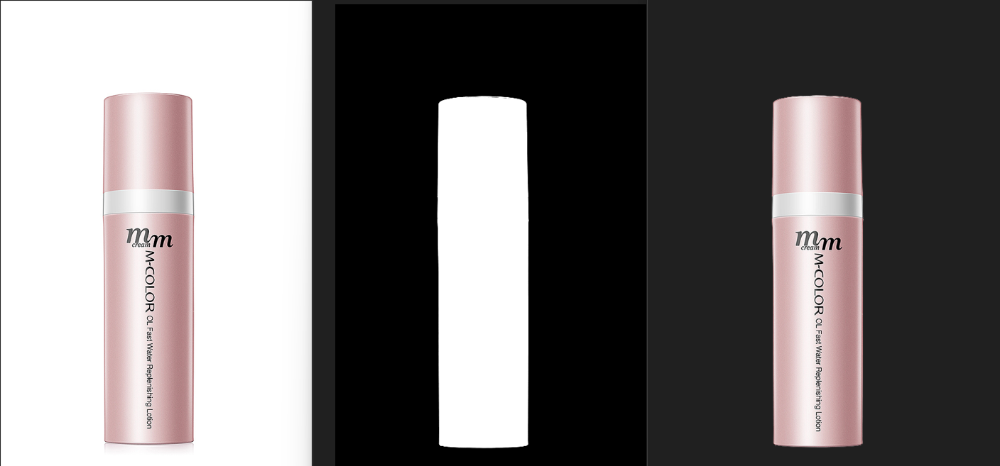

   ```
   需要控制原图尺寸，分辨率太高浪费算力，时间太长，太低影响抠图效果
   ```

   

2. 背景参照图提示词反推

   ```
   可以用WD反推，也可以使用clip询问机，需要背景更还原，就用clip询问机，并且可以使用any switch节点，进行提示词or运算
   ```

   

3. 如果需要产品前景遮挡，请加入以下步骤

   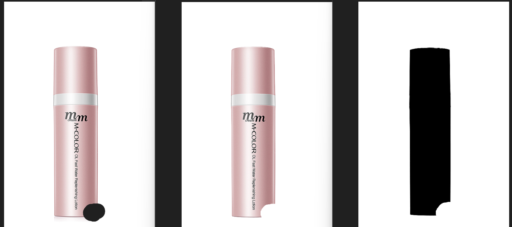

   ```
   手绘出需要遮挡的区域，生成蒙版，以及遮挡后产品区域
   ```

   

4. 使用controlnet控制线稿，深度

   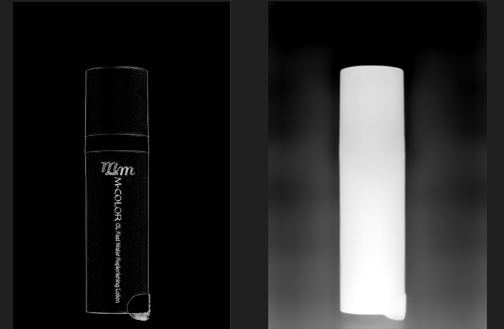

   

5. IPadapter+brushnet重绘

   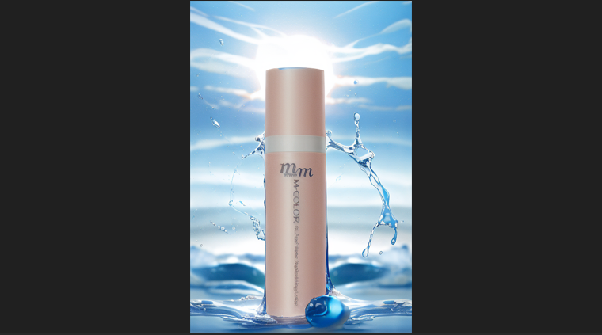

   ```
   IPadapter可以控制，背景更贴合背景参照图，在此我选择降低权重，给与大模型更大的发挥空间
   K+V：key + value ，防止过拟合
   
   将前景遮挡mask传入brushnet，生成产品+背景图，建议此时使用开放性采样器
   ```

   

6. 使用lama清除产品边缘，用mask合并原图和生成的图片

   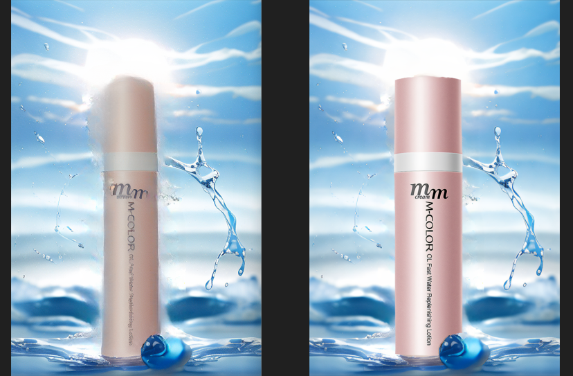

   ```
   可以先拼合原图再进行第7步放大，也可以先放大，再拼合，经过对比先拼合再放大，产品看起来更细腻
   ```

   

7. 高清放大，局部细化

   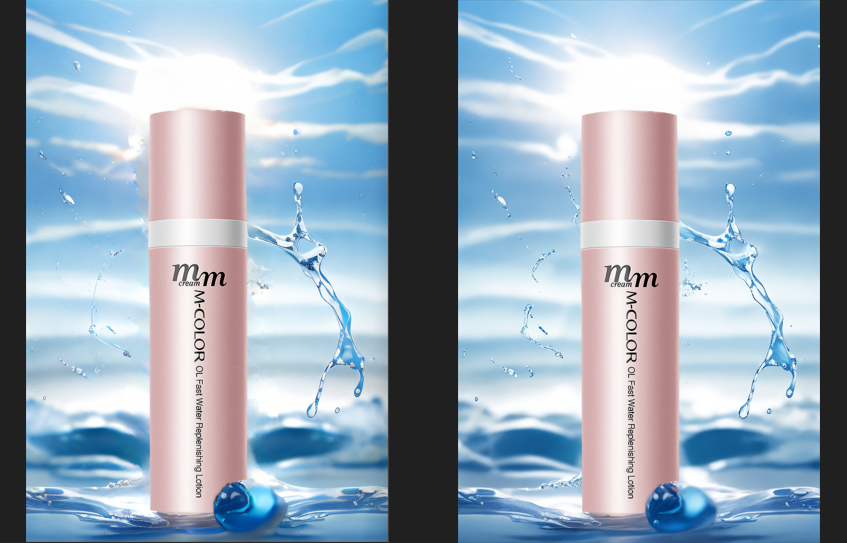

   ```
   
   ```

   

8. IC-light重打光，此产品并未使用，3C类产品更需要重打光

9. SD最终放大

   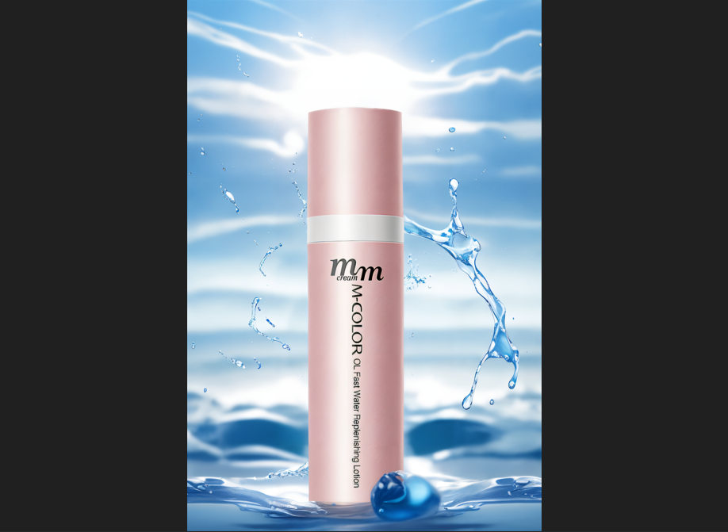

#### 二、项目难点

1. 平衡产品遮挡和产品边缘杂线，基础办法可以调整controlnet权重和开始结束时间，找到平衡点，但是换个产品就需要重新调整，很不方便，所以直接用lama消除有问题的边缘
2. 参考背景有产品时，升级工作流，加入背景图产品清除区域，先清除产品，再将背景图传入IPadapter，此外可以使用any switch节点，进行图片or运算，也可model or运算

## AICG_Comfy UI_电商穿戴工作流

.png)

#### 一、项目落地过程

需求：随手拍模特图，使用工作流生成高清电商图

1. 使用Segmentation和SAM扣取产品或模特图

   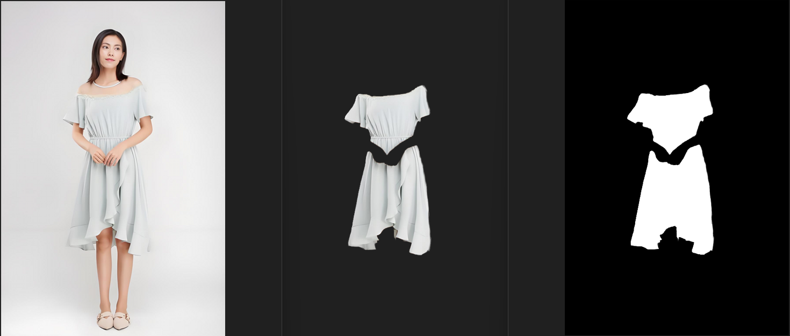

   ```
   1.需要控制原图尺寸，分辨率太高浪费算力，时间太长，太低影响抠图效果
   2.视图片情况而定，可分区抠图，也可一次全扣
   ```

   

2. 使用controlnet控制姿势，线稿轮廓生成模特

   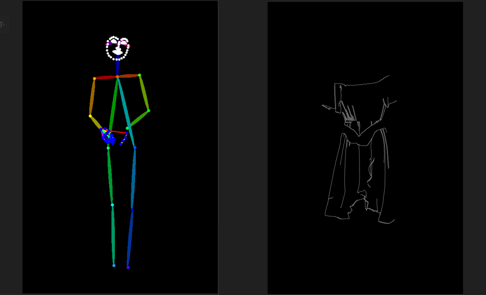

   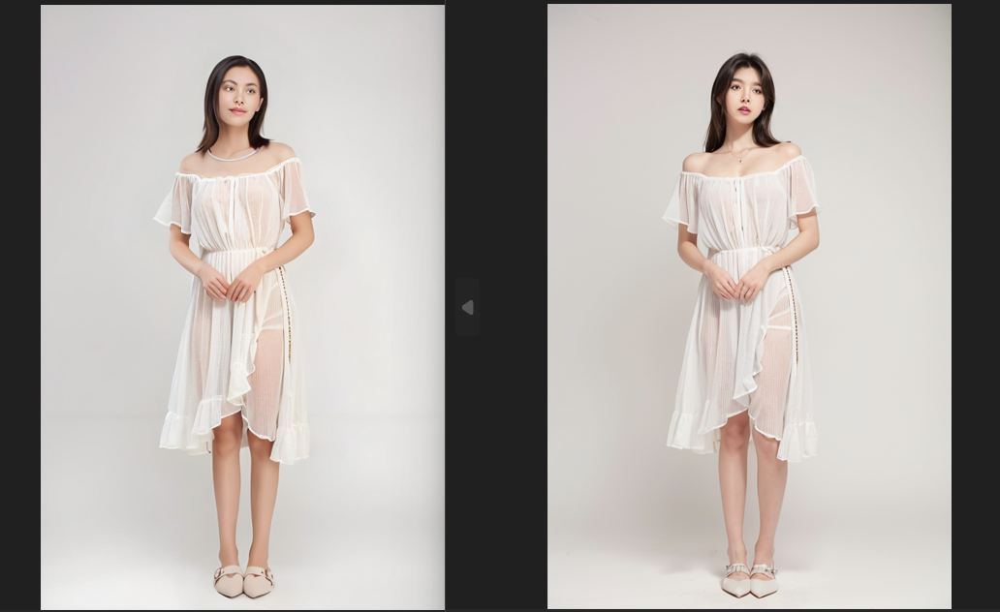

   ```
   1.提示词需从质量，性别，年龄，服装细节（替换物细节如：种类，颜色等），视角，背景，光照等角度写
   2.线稿高阈值不要设置太高，低阈值可适当高一点
   ```

   使用depth和line，再次采样，控制生成模特与原图的相似性

   ```
   depth解决复杂结构的服装，或者替换物以及复杂姿势
   ```

   

3. 用mask合并原图和生成的图片

   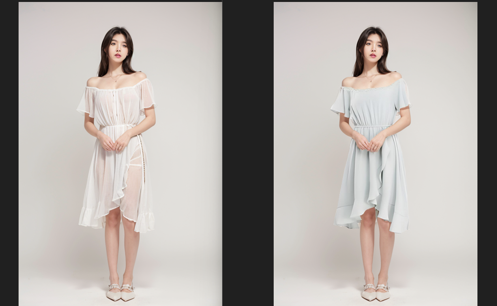

   ```
   如果mask生成不细致，会出现像素错位的情况，视情况调整坐标
   ```

   

4. 面部细化

   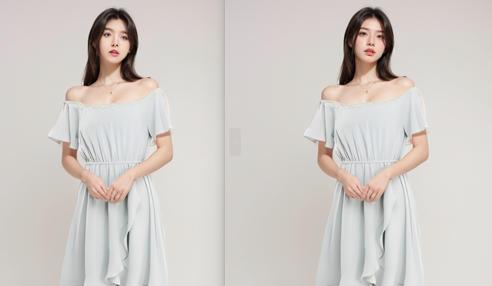

5. sd放大

   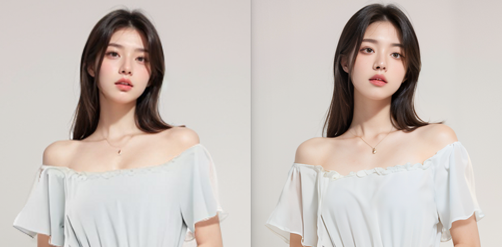

   ```
   重绘幅度可一定程度上解决小幅度像素位移
   ```

   

7. 细节提取

   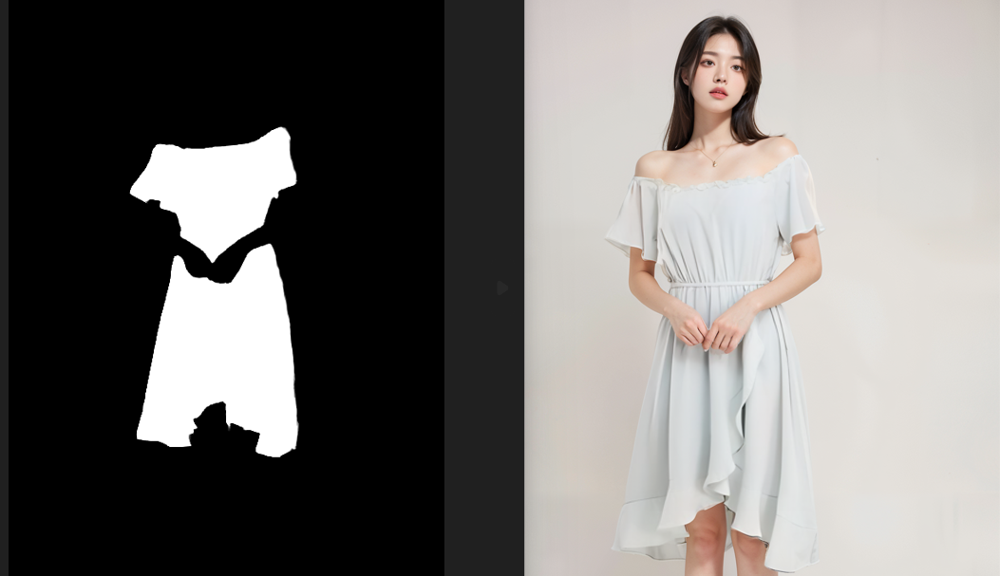

   ```
   细节提取所需原图，mask都需要放大
   ```

   

8. 面部细化、手部细化

   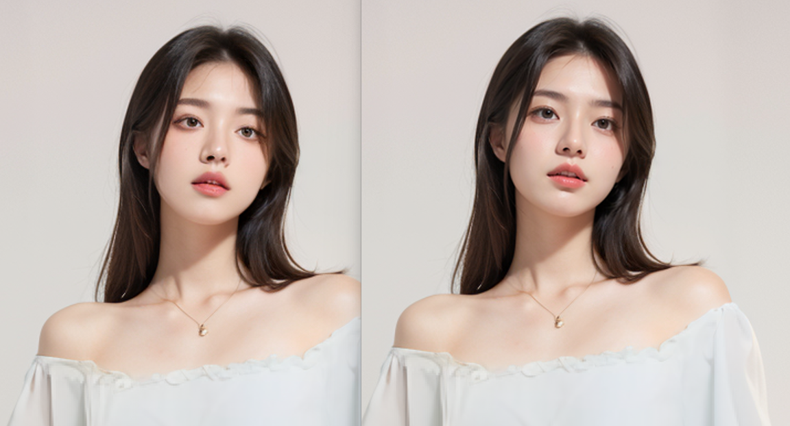

   
   
   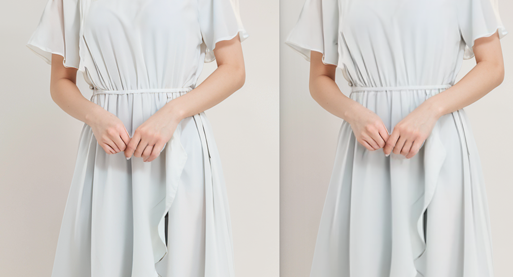
   
   ```
   使用bbox多次采样，需预留多一点上下文
   ```


#### 二、项目难点

1. 图像贴合小像素位移，抠图精细度，拼合时的坐标小范围矫正，适当提高重绘幅度都可解决
2. 图像尺寸间转换，也就是mat1和mat2冲突，需严格控制尺寸缩放
3. 复杂背景的拼合，可用50度灰柔光拼合